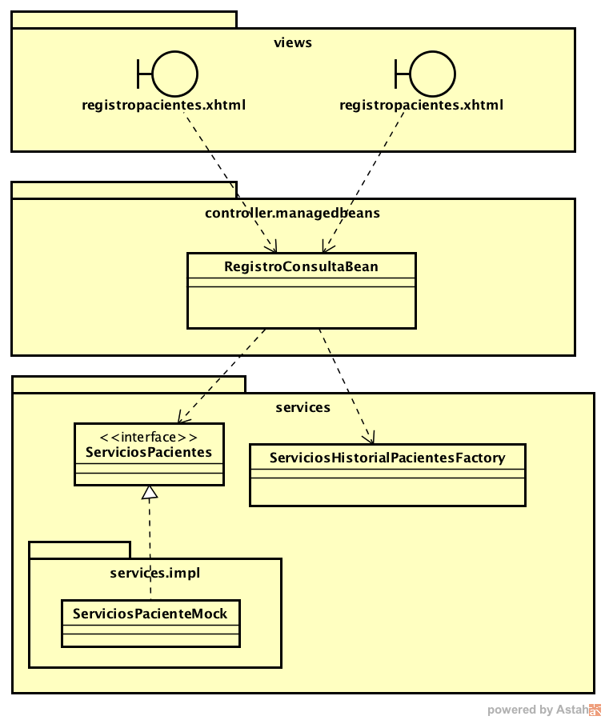
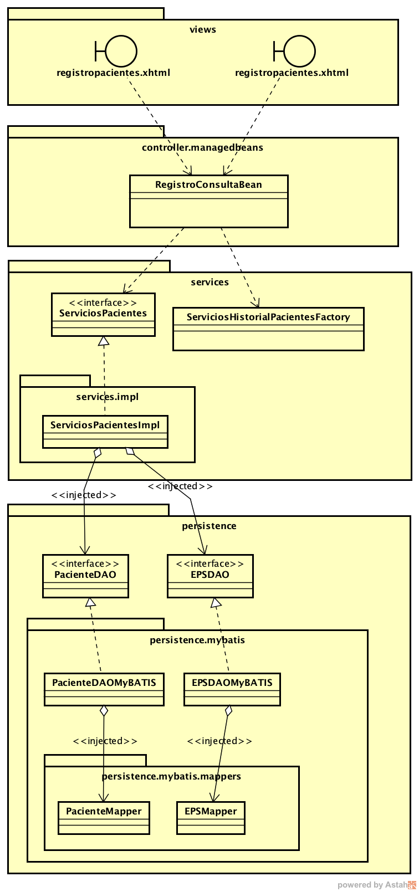

### Escuela Colombiana de Ingeniería
### Procesos de desarrollo de Software - PDSW
#### Tecnologías de persistencia - Frameworks de Persistencia - Introducción a MyBatis


## Parte III (a partir del Martes)

__Preliminar__: Jugar un poco con ['el juego de las ramas'](https://learngitbranching.js.org), o con la [versión 'sandbox'](https://learngitbranching.js.org/?NODEMO) de la misma. 


Ahora, va a integrar lo antes desarrollado al ejercicio anterior (la aplicación Web que hacía uso de un 'mock' de la lógica), la cual corresponde al siguiente diseño:



Para hacer la integración, se va a reempazar el 'mock' de la lógica, por uno real, al cual se le inyectarán unos DAOs de Paciente y de EPS, a través de los cuales consultará y registrará información real a la base de datos. Los DAOs concretos que se inyectarán (a través de Guice), estarán basados en Mappers de MyBATIS, los cuales también les serán inyectados (de manera que no sea necesario preocuparse por la creación de conexiones). El diseño al que se quiere llegar, corresponde entonces al siguiente diagrama de clases:




1. Retome el proyecto anterior (aplicación Web con un 'mock' de la lógica).
2. Sobre dicho proyecto, cree una rama llamada 'mybatis-persistence', y cámbiese a la misma:

	```bash
	$ git branch mybatis-persistence
	$ git checkout mybatis-persistence
	```

	Dado lo anterior, en adelante, para hacer 'push' de los cambios hechos a la rama, haga el 'push' tradicional, pero indicando la nueva rama:

	```bash
	$ git push URL_REPOSITORIO mybatis-persistence
	```

	también tenga en cuenta que al clonar el proyecto, por defecto lo dejará ubicado en la rama 'master'.

4. Copie, del laboratorio actual, al laboratorio anterior:

	* Los Mappers (xml y clases).
	* La configuración XML de MyBatis

5. Rectifique que el proyecto tenga como las dependencias de JSF/Primefaces, MyBatis+GUICE, Drivers de MySQL y H2 (se usará más adelante), y de Shiro (framework de seguridad que se usará más adelante):

	```xml
        <dependency>
            <groupId>com.sun.faces</groupId>
            <artifactId>jsf-api</artifactId>
            <version>2.2.12</version>
        </dependency>
        <dependency>
            <groupId>com.sun.faces</groupId>
            <artifactId>jsf-impl</artifactId>
            <version>2.2.12</version>
        </dependency>
        <dependency>
            <groupId>org.primefaces</groupId>
            <artifactId>primefaces</artifactId>
            <version>5.0</version>
        </dependency>        
        <dependency>
            <groupId>junit</groupId>
            <artifactId>junit</artifactId>
            <version>4.12</version>
        </dependency>
        <dependency>
            <groupId>javax.servlet</groupId>
            <artifactId>jstl</artifactId>
            <version>1.2</version>
        </dependency>
        <dependency>
            <groupId>javax</groupId>
            <artifactId>javaee-web-api</artifactId>
            <version>7.0</version>
            <scope>provided</scope>
        </dependency> 

        <!-- MyBatis, Mybatis-Guice -->       
        <dependency>
            <groupId>org.mybatis</groupId>
            <artifactId>mybatis-guice</artifactId>
            <version>3.4</version>
        </dependency>
        <dependency>
            <groupId>org.mybatis</groupId>
            <artifactId>mybatis</artifactId>
            <version>3.2.2</version>
        </dependency>
        
        <!-- Loggers -->
        
        <dependency>
            <groupId>log4j</groupId>
            <artifactId>log4j</artifactId>
            <version>1.2.17</version>
            <type>jar</type>
        </dependency>
        <dependency>
            <groupId>log4j</groupId>
            <artifactId>apache-log4j-extras</artifactId>
            <version>1.2.17</version>
            <type>jar</type>
        </dependency>
        <dependency>
            <groupId>org.slf4j</groupId>
            <artifactId>slf4j-api</artifactId>
            <version>1.7.25</version>
        </dependency>
        
        <dependency>
            <groupId>commons-logging</groupId>
            <artifactId>commons-logging</artifactId>
            <version>1.1.1</version>
        </dependency>
        
        <!--Dependencias de seguridad-->

        <dependency>
            <groupId>org.apache.shiro</groupId>
            <artifactId>shiro-core</artifactId>
            <version>1.2.1</version>
        </dependency>

        <dependency>
            <groupId>org.apache.shiro</groupId>
            <artifactId>shiro-web</artifactId>
            <version>1.2.1</version>
        </dependency>

        <dependency>
            <groupId>org.apache.shiro</groupId>
            <artifactId>shiro-ehcache</artifactId>
            <version>1.2.1</version>
        </dependency>
        <!--security-->
        
        <!-- Dependencias de MySQL y H2 -->
        <dependency>
            <groupId>mysql</groupId>
            <artifactId>mysql-connector-java</artifactId>
            <version>5.1.36</version>
        </dependency>
        
        <dependency>
            <groupId>com.h2database</groupId>
            <artifactId>h2</artifactId>
            <version>1.4.191</version>
        </dependency>


	```

6. Implemente el modelo de DAOs indicado en el modelo anterior, y siguiendo el esquema de inyección de dependencias plantados. Cada DAO abstracto debe tener las operaciones: loadAll, load, loadByID, save y update.

7. En los DAOs concretos, a partir de lo realizado en el punto 2, __usando los mappers que se supone les serán inyectados (NO SE PREOCUPE AÚN POR CÓMO SE CREARÁN!)__, implemente:
    * El loadAll del DAO EPS.
    * El loadPacienteByID del DAO Paciente.
    * El actualizarPaciente del DAO Paciente.


## Parte IV (Configuración y pruebas)

1. En la raíz de su proyecto incluya un archivo 'tables.sql', el cual tendrá el Script de creación de base de datos compatible con la base de datos embebida H2:


```sql
CREATE TABLE CM_EPS (
`nombre` varchar(100)  NOT NULL,
`nit` varchar(20)  NOT NULL PRIMARY KEY
);


CREATE TABLE `CM_PACIENTES` (
  `id` int(11) NOT NULL,
  `tipo_id` varchar(2) NOT NULL,
  `nombre` varchar(45) NOT NULL,
  `fecha_nacimiento` date NOT NULL,
  `EPS_nit` varchar(20) NOT NULL,
  PRIMARY KEY (`id`,`tipo_id`)
);


CREATE TABLE `CM_CONSULTAS` (
  `idCONSULTAS` int(11) NOT NULL AUTO_INCREMENT,
  `fecha_y_hora` datetime NOT NULL,
  `resumen` varchar(200) NOT NULL,  
  `costo` int(11) NOT NULL,
  `PACIENTES_id` int(11) NOT NULL DEFAULT '0',
  `PACIENTES_tipo_id` varchar(2) NOT NULL DEFAULT 'cc',
  PRIMARY KEY (`idCONSULTAS`)
  ) 
```


7. En el pom.xml, en la sección <build><plugins>, agregue el siguiente plugin para automáticamente crear, en la fase de pruebas, una base de datos embebida H2:


```xml


<!-- create local H2 database -->
            <plugin>
                <groupId>org.codehaus.mojo</groupId>
                <artifactId>sql-maven-plugin</artifactId>
                <version>1.5</version>
                <dependencies>
                    <dependency>
                        <groupId>com.h2database</groupId>
                        <artifactId>h2</artifactId> 
                        <version>1.4.184</version>
                    </dependency>
                </dependencies>
                <configuration>
                    <driver>org.h2.Driver</driver>                    
                    <url>jdbc:h2:file:./target/db/testdb;MODE=MYSQL</url>
                    <username>anonymous</username>
                    <password></password>
                    <autocommit>false</autocommit>
                    <skip>${maven.test.skip}</skip>
                </configuration>
                <executions>
                    <execution>
                        <id>create-db</id>
                        <phase>process-test-resources</phase>
                        <goals>
                            <goal>execute</goal>
                        </goals>
                        <configuration>
                            <srcFiles>                                
                                <srcFile>tables.sql</srcFile>                                
                            </srcFiles>
                        </configuration>
                    </execution>
                </executions>
            </plugin>

```


8. Cree un archivo de configuración alterno de MyBATIS, llamado 'mybatis-config-h2.xml' (ubicado en la misma ruta del original), el cual tenga exactamente la misma configuración, pero que haga uso de la conexión a la base de datos H2, en lugar de la base de datos de MySQL:


```xml
    
    <!-- Sólo cambiar esta sección-->
    <environments default="development">
        <environment id="development">
            <transactionManager type="JDBC" />
            <dataSource type="POOLED">
                <property name="driver" value="org.h2.Driver" />
                <property name="url" value="jdbc:h2:file:./target/db/testdb;MODE=MYSQL" />
                <property name="username" value="anonymous" />
                <property name="password" value="" />
            </dataSource>
        </environment>
    </environments>

```

9. Ahora, modifique la clase encargada de fabricar y mantener el 'inyector' de Guice, para que en lugar de hacer uso de un 'AbstractModule':

```java

        injector = createInjector(new AbstractModule() {

            @Override
            protected void configure() {
                bind(ServiciosPacientes.class).to(ServiciosPacientesMock.class);
                //...
            }

        }
        );

```
Haga uso del XMLMyBatisModule. Siguiendo el mismo esquema, el inyector debe 'instalar' el JdbcHelper de MySQL, agregar la configuración dada en el XML de MyBATIS, y hacer el 'bind' que permitirá a la lógica inyectarle los DAOs hechos con MyBATIS. Agregue también un segundo inyector (testInjector) igual al anterior, pero que haga la configuración haciendo uso del XML que define el uso de la base de datos embebida H2:

```java


        injector = createInjector(new XMLMyBatisModule() {

            @Override
            protected void initialize() {
                install(JdbcHelper.MySQL);              
                setClassPathResource("mybatis-config.xml");
                bind(ServiciosPacientes.class).to(ServiciosPacientesGuiceMybatis.class);
                bind(DaoEps.class).to(MyBatisDAOEps.class);                
                bind(DaoPaciente.class).to(MyBatisDAOPaciente.class);
            }

        }
        );

        testInjector = createInjector(new XMLMyBatisModule() {

            @Override
            protected void initialize() {
                install(JdbcHelper.PostgreSQL);
                setClassPathResource("mybatis-config-h2.xml");
                bind(ServiciosPacientes.class).to(ServiciosPacientesGuiceMybatis.class);
                bind(DaoEps.class).to(MyBatisDAOEps.class);                
                bind(DaoPaciente.class).to(MyBatisDAOPaciente.class);
            }

        }
        );
```

De la misma manera, agregue métodos para obtener las instancias tanto de los servicios estándar, como de los servicios para pruebas:

```java

    public ServiciosPacientes getServiciosPaciente() {
        return injector.getInstance(ServiciosPacientes.class);
    }

    public ServiciosPacientes getTestingServiciosPaciente() {
        return testInjector.getInstance(ServiciosPacientes.class);
    }

```
9. Rectifique que los DAOs implementados con MyBATIS ESCALEN adecuadamente las excepciones que puedan llegar a presentarse al hacer uso de los mappers. Por ejemplo:

```java
    @Override
    public void actualizar(Paciente p) throws PersistenceException {
        try{
            pacienteMapper.actualizarPaciente(p);
            .... //el resto de la implementación
        }   
        catch(Exception e){
            throw new PersistenceException("Error al actualizar el paciente "+idPaciente,e);
        }
        
    }
```

10. En la nueva versión 'real' de la lógica, además de usar los DAOs inyectados, demarque con la anotación @Transactional las operaciones de la lógica. De esta manera, mediante [aspectos](https://www.programcreek.com/2011/08/what-is-aspect-oriented-programming/) se hará transparente la creación de sesiones MyBATIS, el inicio de transacciones, y las operaciones de commit/rollback de acuerdo con el resultado de dichas transacciones:


```java
    @Transactional
    @Override
    public void agregarConsultaPaciente(String idPaciente, String tipoid, Consulta consulta) throws ExcepcionServiciosPacientes {
         try {
            daoConsulta.guardar(consulta,idPaciente,tipoid);
        } catch (PersistenceException ex) {
            Logger.getLogger(ServiciosPacientesGuiceMybatis.class.getName()).log(Level.SEVERE, null, ex);
        }  
    }
```

11. Ajuste las pruebas, de manera que las mismas hagan uso de la instancia de la capa lógica que hace uso de la base de datos volátil.

12. Haga los ajustes restances necesarios para que la aplicación quede funcionando correctamente, accediendo a la base de datos MySQL.